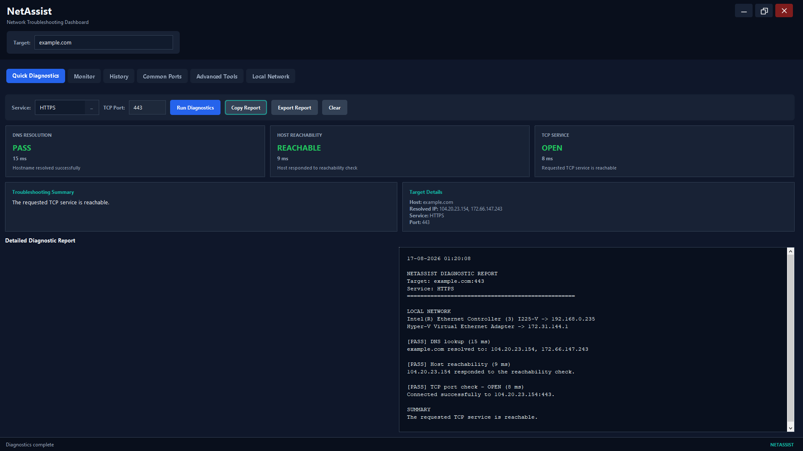
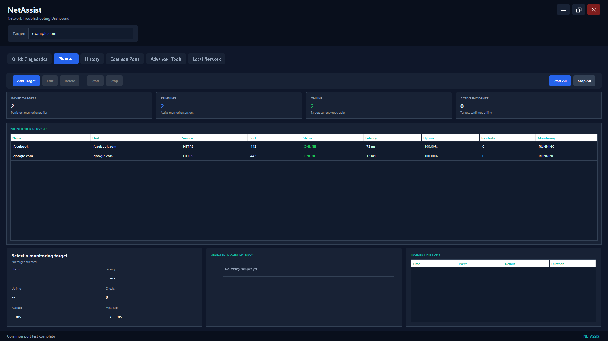
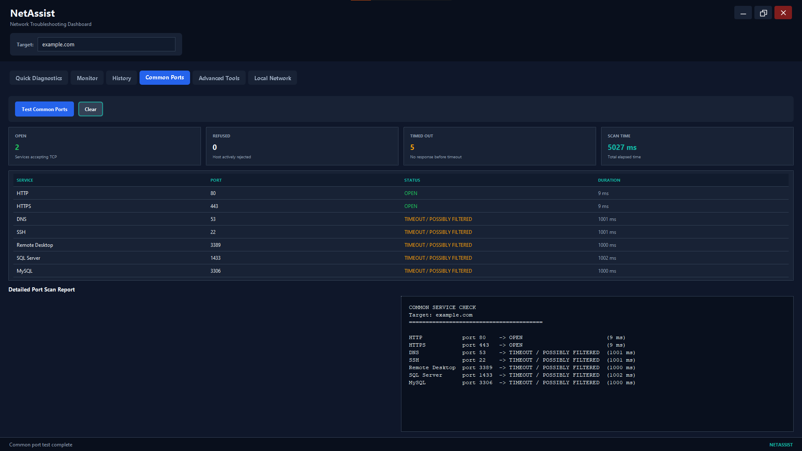
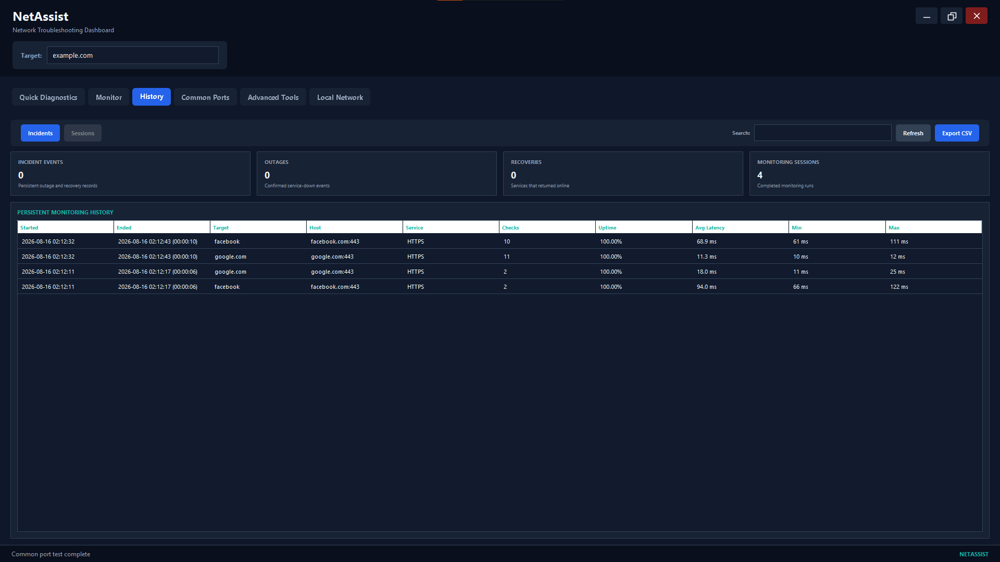

# NetAssist

NetAssist is a Java 17 Swing desktop application for network diagnostics and
continuous TCP service monitoring. It combines quick troubleshooting tools,
multi-target monitoring, incident tracking, historical metrics, and report
exports in one desktop dashboard.

## Highlights

- Resolve DNS names and test host reachability.
- Check TCP services using common-port presets or a custom port.
- Run `nslookup`, traceroute/tracert, and local-interface diagnostics.
- Monitor multiple hosts independently with configurable check intervals.
- Reduce false alerts with failure and recovery thresholds.
- Track live latency, uptime, checks, and active incidents.
- Persist monitoring targets, incidents, and completed sessions.
- Search history and export diagnostics to TXT or monitoring data to CSV.
- Display system-tray notifications for confirmed outages and recoveries.

## Technology

- Java 17
- Swing and AWT
- Maven
- Java networking and concurrency APIs

The application uses only the Java standard library; no third-party runtime
dependencies are required.

## Requirements

- JDK 17
- An internet connection for the Maven Wrapper's first run

Windows is the primary platform. NetAssist also provides basic Unix-like
fallbacks for traceroute and local IP information.

Verify the tools before building:

```text
java -version
.\mvnw.cmd -version
```

Both commands should report Java 17 for a Java 17 build. A separate Maven
installation is optional because the repository includes the Maven Wrapper.

## Build and Run

From the repository root:

```text
.\mvnw.cmd clean package
java -jar target/NetAssist.jar
```

Convenience scripts are also available:

```text
build.bat
run.bat
```

On macOS or Linux:

```text
./mvnw clean package
./run.sh
```

## Run in Eclipse

1. Select **File → Import → Maven → Existing Maven Projects**.
2. Choose the NetAssist repository and finish the import.
3. Right-click the project and select **Maven → Update Project**.
4. Confirm the project JRE is **JavaSE-17** under **Properties → Java Build Path**.
5. Confirm compiler compliance is **17** under **Properties → Java Compiler**.
6. Open `src/main/java/com/yousef/netassist/Main.java` and select
   **Run As → Java Application**.

## Features

### Quick diagnostics

NetAssist runs DNS, reachability, and TCP checks and presents their results as
clear pass, warning, or failure cards. Detailed reports can be copied or saved
as text files.

### Multi-target monitoring

Saved monitoring profiles can be started independently or together. Each
session tracks current status, latency, uptime, check totals, latency statistics,
and an incident timeline.

An outage is confirmed only after the configured number of consecutive
failures. Recovery uses the same threshold-based approach.

### History and notifications

Monitoring profiles, incidents, and completed sessions persist across launches.
The History tab supports search, aggregate metrics, and CSV export. When the
operating system supports `SystemTray`, confirmed outages and recoveries also
produce desktop notifications.

## Screenshots

### Quick diagnostics

DNS resolution, reachability, and TCP service checks with a detailed diagnostic
report.



### Service monitoring

Live multi-target status, latency, uptime, incident counts, and monitoring
controls.



### Common ports

Concurrent checks for frequently used services with status and timing details.



### Monitoring history

Persistent incident and session records with search and CSV export.



Screenshot assets and privacy guidance are documented in
[docs/screenshots/README.md](docs/screenshots/README.md).

## Runtime Data

NetAssist stores user-created monitoring data outside the repository:

```text
%USERPROFILE%\.netassist\
```

On Unix-like systems, the equivalent location is `~/.netassist/`.

The directory can contain:

- `monitor-targets.properties`
- `monitor-incidents.tsv`
- `monitor-sessions.tsv`

## Project Structure

```text
NetAssist/
├── pom.xml
├── src/main/java/com/yousef/netassist/
│   ├── Main.java
│   ├── DashboardFrame.java
│   ├── NetworkDiagnostics.java
│   ├── WindowsDiagnostics.java
│   ├── MonitoringDashboardPanel.java
│   ├── MonitoringManager.java
│   ├── MonitoringSession.java
│   ├── MonitoringTargetStore.java
│   ├── MonitoringHistoryStore.java
│   ├── HistoryPanel.java
│   └── supporting models and utilities
├── docs/
└── target/                         generated by Maven
```

See [docs/ARCHITECTURE.md](docs/ARCHITECTURE.md) for a component overview.

## Responsible Use

Run network diagnostics and port checks only against systems and networks that
you own or are authorized to troubleshoot.

## License

No license has been added yet. Unless a license is provided, the repository is
not automatically open source.
